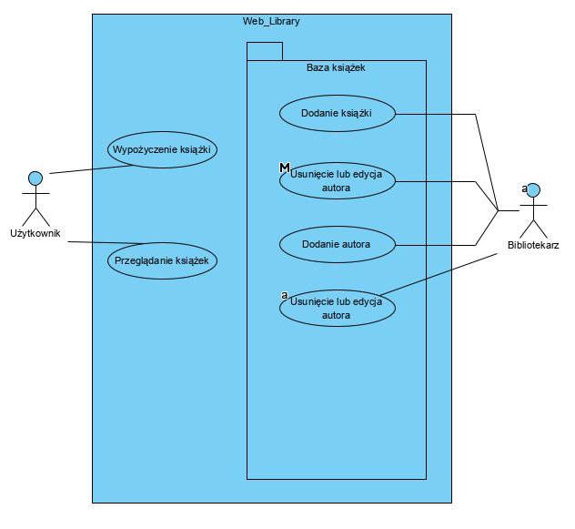
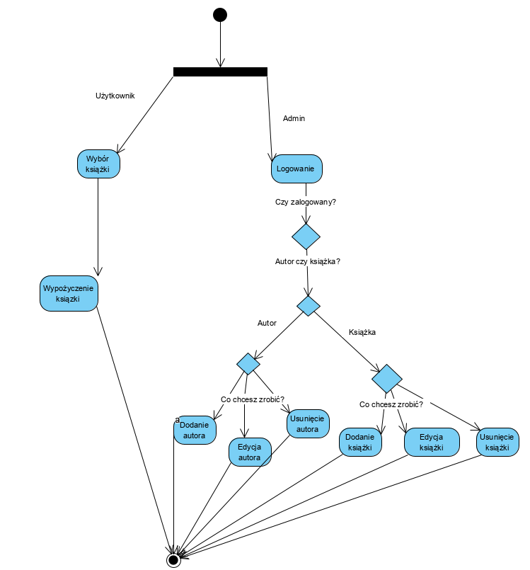

#### Bodziacka Aleksandra
# Web_Library
> Program zostanie stworzony w celu elektronicznego wypożyczenia książek z biblioteki.
Do oprogramowania mają dostęp zarówno klienci biblioteki, którzy mogą złożyć swoje zamówienie, jak i jej pracownicy, którzy mają możliwość edycji bazy danych.

## Spis treści
* [Cele systemu](#cele-sytemu)
* [Użytkownicy](#uzytkownicy)
* [Technologie](#technologie)
* [Funkcjonalności](#funkcjonalności)
* [Diagram UML](#diagram-uml)
* [Kontakt](#kontakt)

## Cele systemu
Przeznaczenie systemu: możliwość internetowego wypożyczenia książek w stacjonarnej bibliotece. Aplikacja daje gwarancje użytkownikowi na wcześniejsze zarezerwowanie książek przed osobistą wizytą.
Dodatkowo system jest pomocą dla bibliotekarzy, którzy w sprawny sposób mogą edytować bazę książek oraz na odległość informować klientów o dostępności poszczególnych książek.

## Użytkownicy
Użytkownicy aplikacji dzielą się na 2 grupy:
* ***Klienci*** - osoby zainteresowane wypożyczeniem (zarezerwowaniem) danej książki mogą przeglądać dostępne książki, czytać opisy książek, jak i wypożyczać.
* ***Bibliotekarze*** - mogą edytować bazę książek (dodawać, usuwać, zaznaczać dostępność) oraz mają wgląd do kont wypożyczających (zaznaczają wypożyczenie - gdy osoba przychodzi do bliblioteki po książkę, jak i oddanie- gdy ją zwraca).

## Technologie
* Framework PHP MVC Symfony

## Funkcjonalności
Funkcjonalności serwisu podzielone są na 2 grupy: funkcjonalności użytkownika oraz admina (bibliotekarza).
##### Funkcjonalności użytkownika
* Przeglądanie dostępności książek
* Przeglądanie autorów 
* Czytanie opisów dot. danej książki
* Przeglądanie kategorii
* Wypożyczenie (zarezerwowanie) danej książki

##### Funkcjonalności admina
* Usuwanie książki z bazy danych
* Dodawanie książki do bazy danych
* Usuwanie autora z bazy danych
* Dodawanie autora do bazy danych
* Modyfikowanie dostępności książek
* Zaznaczanie wypożyczenia i oddania książki przez klienta

##### Model MVC
Wszystkie te funkcjonalności przedstawione będą za pomocą wzorca architektonicznego MVC (model-view-controller).
> ***Model*** -  odpowiedzialny jest za komputerową reprezentację problemu zawiera funkcje, które są dostępne w danym oprogramowaniu (w nim zadeklarujemy wszystkie zmienne oraz obiekty potrzebne do wykonania aplikacji).
* Funkcja sprawdzająca czy daną książkę można zarezerwować
* Zapisanie rezerwacji w bazie danych
* Zwrócenie do widoku informacji o efekcie czynności użytkownika
* Funkcja usuwająca/dodająca książkę(autora) do bazy danych
* Funkcja umożliwiająca modyfikację dostępności książki
    
>***Widok*** - jest odpowiedzialny za prezentację danych w obrębie graficznego interfejsu użytkownika (dzięki niemu klient     będzie miał możliwość wyborów poszczególnych opcji).
* Możliwość nawigowania między odnośnikami (pasek nawigacji)
* Wyświetlanie książek, autorów, kategorii, opisów (tabeli z bazy danych)
* Wyświetlanie komunikatu o powodzeniu (lub też niepowodzeniu) rezerwacji książki
* Wyświetlanie danych do kontaktu

>***Kontroler*** - odbiera i przetwarza dane wejściowe użytkownika (jest łącznikiem między widokiem a modelem, czyli dzięki     niemu program będzie wiedział jakie informacje wyciągnąć z modelu po akcji użytkownika).
* Pobieranie informacji zawartych w modelu i przekazywanie ich do widoku
* Zwracanie widoków
* Wykrywanie napotkanych (ewentualnych) błędów

## Diagram UML

## Kontakt
Created by [AleksandraBodziacka](olabodziacka.op.pl) - feel free to contact me!
